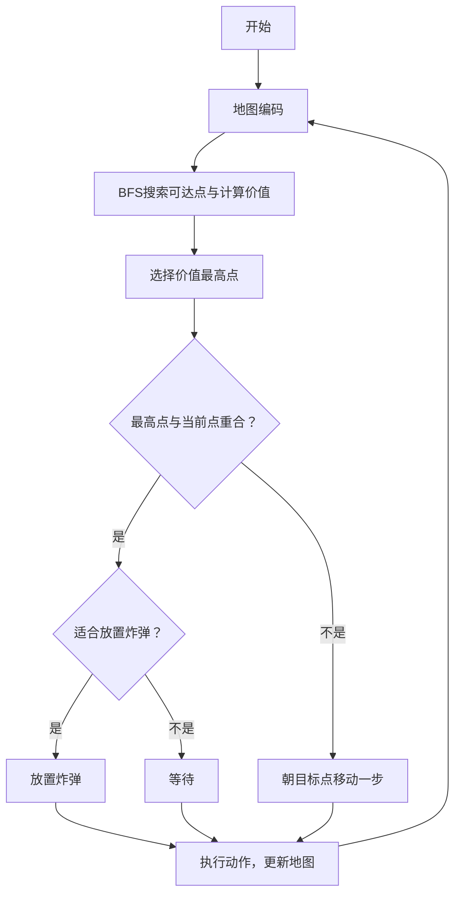

## 鹤冲天   
## 主体思路

算法主要采用搜索的方法，在每一回合手动计算每个可达点的价值，然后选择价值最高的位置移动，当价值最高的位置与玩家位置重合时，判断是否放置炸弹，如果适合则放置炸弹，否则等待。

### 大致流程图如下：

## 具体内容

在题目提供的SDK基础上，只增加了player/player.py的代码

其中

### class Client
用于与server连接的类，直接使用的题目的main.py中的Client

### class Player
玩家类，
其中
#### init(client)
client为与服务器交互的客户端   
action_map为移动坐标与行动类型的字典映射

#### start()
开始与server交互   
发送与接受报文，进行游戏回合

#### bomb_value(map, x, y)
计算地图上(x,y)坐标处放置炸弹的价值，具体方法为根据在爆炸范围内的每个方向的第一个方块，如果是可破坏方块则+10分，如果是道具则-50分

#### move_value(map, dis, bombs)
计算地图上每个可达点的价值，dis为搜索得到的每个可达点的距离和行动列表，bombs为地图上的炸弹列表；   
计算方法为：   
如果该位置有道具，则+10分  
如果该位置在炸弹的爆炸范围内，则-300分   
最后减去该位置与玩家距离的2倍

#### bomb(x, y, bombs)
判断某点(x,y)是否在爆炸范围内

#### decision(info)
决策函数，根据move_value计算的得到的值决定下一步采取的动作   
其中包含决定是否适合放置炸弹的判断，判断方式为该位置价值是否大于0

#### search(map, x, y, bombs)
结合BFS和dp算法，从玩家位置开始搜索每个可达点，并同时计算该点的距离和炸弹价值。   

#### map_encode(map_resp)
解析response，对地图进行编码，编码规则如下：   
空格：0   
不可破坏方块：1    
可破坏方块：2   
道具：道具Type编码值+2   
炸弹：爆炸范围+8   
同时将所有炸弹位置和爆炸范围保存为一个列表   
将玩家信息也保存为一个列表
